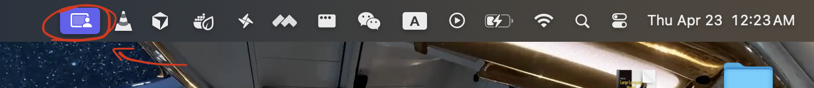

# First Time Setup

1. Open a new terminal (`cmd + space` to open spotlight search and enter "Terminal")
2. In the terminal, enter the following command

```bash
curl -fsSL https://raw.githubusercontent.com/Emericen/recorder/main/install.sh | bash
```

3. Wait for it to finish. You should see `✅ Installed! You may close this terminal and move to the next step.` Close the terminal and start a new one.
4. In the new terminal, enter the following command and accept screen share permission request.

```bash
record --grant-screen
```

5. Next, enter the following command and accept accessibility permission request

```bash
record --grant-access
```

# Start & Stop Recording

In terminal, start by running

```bash
record
```

You will see a screenshare icon on the top of your screen



And a new folder will immediately show up on your desktop. Its name looks like `recording-<timestamp>`.

To stop, simply click on that icon and click `Stop Sharing`.

Afterwards, just send Eddy the generated folder on desktop :)

# For Developers

```bash
npm install
npm run dev
```